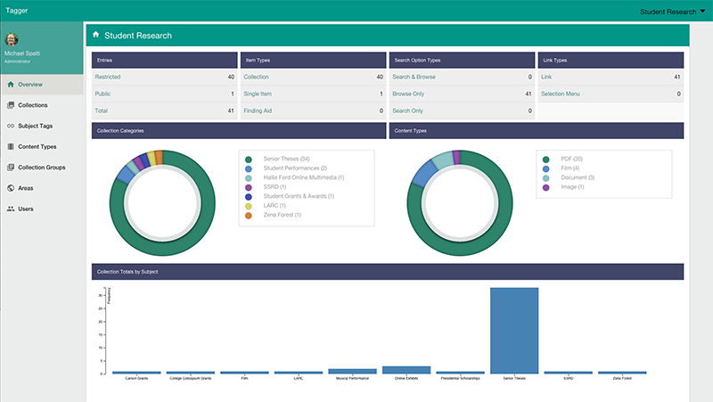
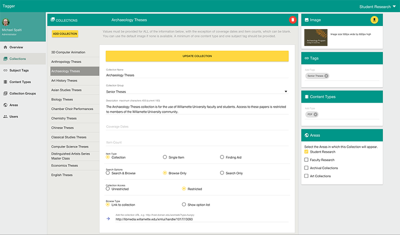

#  Tagger

Tagger is an AngularJs, Express, NodeJs application that persists data in a MariaDb relational database.  It includes a public REST API for creating clients that use
information about the collections managed in Tagger.

## Area Overview


## Collections Page


### Setup

To get started with development, clone the project into your working directory.


Next, install the dependencies:

    npm install

    bower install

Finally, the application requires mysql or MariaDb.  For development, you need to install mysql on your machine and create empty databases (acomtags is the production database, so you don't actually it for local development work.):

    acomtags_development
    acomtags_test
    acomtags

Assign access permissions to the empty databases. 

To access your mysql databases, set the mysql user name and password the the project configuration. To do this, open `config/environment.js` and edit the `user` and `password` for each of the databases. Pay attention to the different environment configurations since these are associated with different databases.  
 
 The Express server will run setuid and setgid on startup.  On the production server, both values should be set to `node`.  When working on your own development machine, set these values to match your own `uid` and `gid`.
 
 The configuration also supports `mysql` and `mariadb` clients via the `mysql.dialect` parameter.
  
 Here's an example development configuration:

    development: {
       root: rootPath,
       app: {
         name: 'acomtags'
       },
       uid: 'user-uid',
       gid: 'user-gid',
       port: 3000,
       mysql: {
         db: 'acomtags_development',
         user: 'user-name',
         password: 'user-passwd',
         host: 'localhost',
         port: 3306,
         dialect: 'mysql'
       },
       convert: '/usr/local/bin/convert',
       identify: '/usr/local/bin/identify',
       taggerImageDir: '/usr/local/taggerImages',
       adminPath: '/views',
       googleClientId: 'your-google-client-id',
       googleClientSecret: 'your-google-client-secret',
       googleCallback: 'http://localhost:3000/auth/google/callback',
       nodeEnv: env
     }

The application uses Sequelize for the ORM.  Tagger database tables are generated by Sequelize when the application is first started. 

### Credentials

You will need to provide a `config/credentials.js` file.  (We track the current credentials file in a separate repository.)  Sample:

```javascript
''use strict';
 
 var credentials = { 
   develuid: 'your system uid',
   develgid: 'your system gid',
   develdbuser: 'database user name',
   develdbpassword: 'database password',
   googleClientId: 'google client id',
   googleClientSecret: 'google client secret',
   googleCallback: 'path to google callback',
   uid: 'node uid',
   gid: 'nod gid',
   user: 'production database user',
   password: 'production database password',
   productiondbhost: 'production database host' 
 };

module.exports = credentials;

```

### User Permission

Tagger uses Google OAUTH2 for authentication.  Authorized users are then identified by their Google profile email id (e.g. userh@wu.edu).  Currently, we are not creating a default administrator
account when database tables are created.  So, when logging into Tagger for the first time, you first must add yourself to the Users table.  Insert values for name, email, area (0 means administrator), createdAt and updatedAt.

### Development

To start the development server, type:
 
 `grunt develop`

When you first start the application in development mode, Sequelize will create tables in the `acomtags_development` database.

The Express server will run on the development port configured in `config/environment.js` (e.g. 3000).  A browser window is opened on start and the watch service should restart the Express server and compiles sass whenever files are updated.  

The Tagger application uses Jade templates. 

The grunt `watch` task doesn't update the browser window automatically with file edits.  This might be possible, but
my attempt to use livereload with the Jade templates ran into a problem with conditional logic in the templates (much of that is now removed).  So, when coding you'll need to manually refresh the browser.


### Testing

(Tests are not enabled for the current release.)

The test environment runs a series of integration tests against the `acomtags_test` database. Before each test run, Sequelize will drop the existing tables and create new ones.

To start test mode for the AngularJS public UI:

    grunt karma

To test the backend Nodejs application:

    grunt mocha

### Runlocal

The AngularJS application is compiled using `grunt publish` and copied to the `dist` directory inside the module.  You can preview the result using the runlocal task:

    grunt runlocal

### Production

First, make sure nodejs is installed on the server. It's wise to use the identical nodejs version that you are using in your development environment.

You need to decide how to manage the application runtime on your server. Currently, we use the `forever` CLI to launch and keep the Express application online. Install `forever` globally as follows:

    sudo npm install forever -g
    
Create an init.d script that launches the application using `forever` as well as a second init.d script that starts the `redis` session store. Add these two startup tasks to your system runlevels. 

Create a `node` user on the system. Next, verify that your init.d startup script sets the `NODE_ENV` value to 'production.' Example: `NODE_ENV=production $DAEMON $DAEMONOPTS start $NODEAPP`. 

The following deployment assumes that you have previously built and tested the application on your development machine. 

   1. Copy the project to a location on the server. If you know what you are doing, you can omit unnecessary development files.
   2. Edit the details of the production environment in `config/environment.js`, including database access credentials, paths, and Google OAUTH2 credentials. 
   3. Set the owner and group for project all files (including .* files) to the `node` user.  
   4. Start `forever` via the init.d script (e.g. /sbin/service acomtagger start). If you are updating an existing installation, you should stop `forever` before replacing code and start again after the changes are made.

### Oauth2 Authentication Configuration

Access to the Tagger module is controlled by Google OAuth2.  After a successful OAuth2 login, the `Users` table of the Tagger database is queried by the email address returned in the OAuth2 user profile.  To access Tagger, the email address 
 must be in the database.  You will need to add this manually.

### Configuration Params

Configuration file: config/environment.js

- root: path set by module
- port: Express port
- uid: Express system user
- gid: Express system group
- redisPort: port used by the redis session store (production environment only)
- mysql.db: database name
- mysql.user: database user
- mysql.password: database password
- mysql.host: host name (e.g. libdb.willamette.edu)
- mysql.dialect: the client type (mysql or mariadb)
- convert: location of ImageMagick convert library
- identify: location of ImageMagick identify library
- taggerImageDir: path to tagger images
- adminPath: path to jade files
- googleClientId: the Google ID for this application (used by OAUTH2)
- googleClientSecrect: Google secret (used by OAUTH2)
- nodeEnv: current node environment (startup setting or default)


